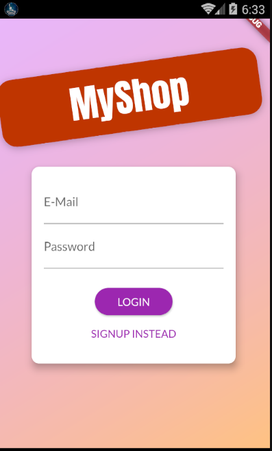
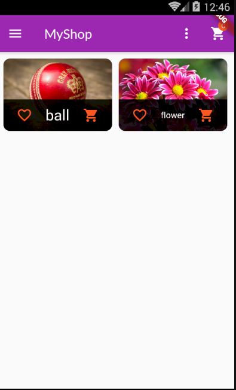
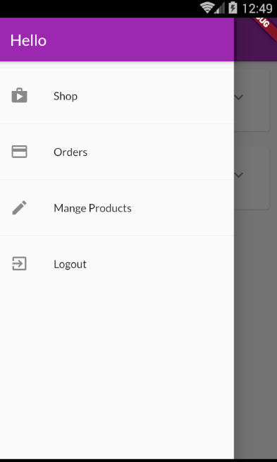

# Shop App
E-Commerce mobile app with cross-platform(Flutter) lets the user register or login and the user can order a product and add his own products and can manage it by edit or delete.   

## Tools
- Authentication: Firebase Authentication
- Backend: Firebase Firestore
- State management: 
   - Provider Package with ValeNotifier and ChangeNotifier
 
- Packages:
   - firebase_core
   - firebase_auth
   - cloud_firestore
   - provider
   - intl
   

## Screenshots

<table>
  <tr>
    <td>Authentication</td>
     <td>Home</td>
     <td>Drawer</td>
     <td>Edit/Delete Product</td>
  </tr>
  <tr>
    <td></td>
   <td></td>
   <td></td>
    <td></td>
</tr>
 </table>
